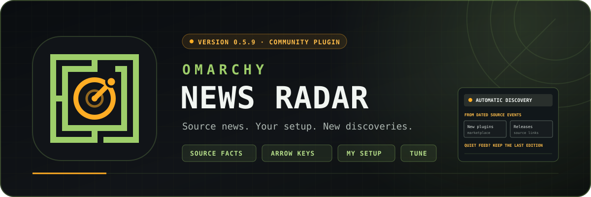

# Omarchy News Radar

> Your personal front page for Omarchy.

Catch up on Omarchy releases, official news, plugin activity and videos in one keyboard-first desktop reader. Start with a finite briefing, understand changes that affect your setup, discover recent marketplace additions, and read source-backed version changes. Your reading state, enabled-plugin matching, follows, and mutes stay on your device.

[Install from the marketplace](https://plugins.omarchy.org/plugin.html?id=io.github.mtolhuys.news-radar) · [Read the web edition](https://mtolhuijs.nl/news-radar/) · [Follow via RSS](https://mtolhuijs.nl/news-radar/feed.xml)

Omarchy News Radar is an independent community project.


The current interface, captured from the inspected 0.5.3 runtime with the live public feed on 6 September 2026. Versions 0.5.4 through 0.5.6 repair data completeness, reading actions, focus behavior, and Omarchy 4.0.3 compatibility without changing this pictured layout. Story content and counts change with the feed.

## Install the published v0.5.6

Open the [marketplace listing](https://plugins.omarchy.org/plugin.html?id=io.github.mtolhuys.news-radar) for its reviewed snapshot and installation instructions. To install the current public version directly from the repository's default branch:

```bash
omarchy plugin add https://github.com/mtolhuys/omarchy-news-radar --enable --yes
```

Click the newspaper in your bar to open Radar. You can also open it without setting up a shortcut:

```bash
omarchy-shell shell summon io.github.mtolhuys.news-radar
```

To add **Omarchy News Radar** to your Apps menu, run this optional setup step:

```bash
~/.config/omarchy/plugins/io.github.mtolhuys.news-radar/bin/news-radar-launcher install
```

The explicit launcher command creates the **Omarchy News Radar** row in the normal Apps menu with the bundled newspaper mark. Omarchy's third-party plugin lifecycle intentionally runs no install hooks, so a public plugin add cannot create that XDG entry implicitly. `status`, `install`, and `remove` are idempotent and refuse symlinked, modified, unowned, or unrelated targets.

### Explicit shortcut setup

Radar uses `Super+Alt+N`; Omarchy's `Super+Shift+N` Editor/Neovim shortcut remains unchanged. First inspect the personal configuration and live binding table without mutation:

```bash
~/.config/omarchy/plugins/io.github.mtolhuys.news-radar/bin/news-radar-shortcut status
```

If `status` reports `classification: free`, install the owned Radar binding:

```bash
~/.config/omarchy/plugins/io.github.mtolhuys.news-radar/bin/news-radar-shortcut install
```

The helper refuses personal, multiple, unknown, symlinked, unowned, or ambiguous configuration. It creates a timestamped backup, writes one clearly marked bind-only Radar block, reloads Hyprland, validates the live action and config errors, and rolls back on failure. There is no unbind, Editor replacement, or force flag.

If an earlier Radar version installed the old close-on-repeat binding, updating to 0.1.6 or later reloads Radar and repairs that one byte-exact unmodified Radar-owned block from `toggle` to `summon`. It creates the same private backup, atomically reloads and validates Hyprland, and restores the old block on failure. This narrow update command cannot create a shortcut when the chord is free and leaves edited, personal, conflicting, multiple, symlinked, or ambiguous configuration unchanged. If automatic validation cannot complete, opening Radar shows **Update shortcut** as a visible retry; `status` reports `owned-legacy`, and the explicit `install` command performs the same migration.

To choose another free chord, skip the helper and add your own reviewed line to `~/.config/hypr/bindings.lua`, for example:

```lua
o.bind("SUPER + SHIFT + R", "Omarchy News Radar", "omarchy-shell shell summon io.github.mtolhuys.news-radar")
```

## Panel controls

On first use, **Browse current stories** keeps the backlog unread; **Start from today** marks the displayed edition read and keeps those stories available to browse. Both preserve saved stories and local preferences. Existing readers keep their reading state and skip this welcome choice when upgrading.

**Front Page** brings together your retained brief, recent marketplace additions, dated version changes and documented updates for your setup. Opening this overview does not mark a hidden story read. Choose a briefing card to enter its reader. The brief holds up to five story groups, selected from unread source facts and your local filters. It favors critical or reviewed notable news, official Omarchy changes, enabled-plugin activity, and a discovery when available. Updates for the same plugin share a group with each original source accessible under **Show updates**. Routine verification changes do not consume a briefing slot on their own, and popularity metrics never choose the stories.

Your brief survives closing, reopening, and refresh. New arrivals stay available in the other sections and are offered through **New briefing**; they do not refill the brief while you read. **Mark briefing read** finishes only its included events. **Mark group read** finishes only one group's included events. A finished brief stays finished until you choose another; skipped stories remain unread. If older updates leave the rolling edition, Radar says so instead of claiming they were read.

- `1`–`N`: jump the currently visible sections (Front Page, For You, Core, Plugins, YouTube, Saved; hidden rails leave the number keys).
- `Tab` / `Shift+Tab`: cycle forward or backward through sections during normal navigation.
- `F6`: enter or leave Home, My setup, or briefing controls. Within that mode, `Tab` / `Shift+Tab` cycles the available cards and actions. In expanded group history, Up/Down and Home/End select an update; Enter opens its original source.
- In project, discovery, and context details, the arrow keys or `j` / `k` move between every visible action and included-project card; `Home` / `End` jump to the first or last action, Enter activates it, and `Page Up` / `Page Down` scroll the reading surface.
- On My setup, End or Down from the final plugin reaches **Read news for your setup**; Up returns to the final plugin and Enter opens the current matching news.
- `j` / `k` or arrow keys: select a card on Home/My setup or move the selected story in a source reader. Crossing the story viewport bottom smoothly anchors the newly selected row at the top; crossing the top while moving upward keeps the highlight visibly anchored even during key repeat. Normal row-by-row movement continues while the next story remains visible. In sections with more pages, Down from the final loaded story focuses **Load more**; Up returns focus without moving the retained story or viewport; Enter loads the next page.
- `Home` / `End`: first or final keyboard target in the current view; My setup's final target is **Read news for your setup**.
- `Page Up` / `Page Down`: scroll the current overview or article without changing selection, read state, or saves.
- `u`: mark the selected story read or unread locally.
- `/`: focus local search; `Escape` returns to panel navigation.
- `o` or `Enter`: open the selected overview card; in a source reader, open the selected validated HTTPS source.
- `s`: save or unsave the selected story locally.
- `r`: **Check for updates** once against the published static edition. Cached stories remain readable and the other sections adopt newer news automatically. Front Page keeps its current brief; normal success adds no status banner.
- `t`: open **Tune** settings.
- `,`: open **Settings** for the current section.
- `Escape`: leave details or an open control surface, then close the panel. `q` closes the panel during normal navigation.
- `Tune`: enable or disable the top-bar newspaper, story images, and the Core, Plugins, and YouTube rails.
- `⚙ Settings`: inspect the section's fixed sources, then locally refine time, significance, unread/image state, and story types. Names, icons, order, background, and source scope remain canonical.
- `a`: **Mark briefing read** on Front Page. In other sections, **Mark all as read** atomically marks every unread story matching the section's Settings, including unloaded pages. Temporary search does not change either scope.
- `Load more`: in sections other than Front Page, reveal the next twelve matching stories from the already validated bounded edition by pointer or keyboard.
- `Unread only`: a story read during the current view remains visibly marked **READ** in its existing position until the section, search, or filters change, preventing the active row from disappearing while its unread count updates.

Section-rail numbers show **unread stories**, under the heading **SECTIONS · UNREAD**. Switching All / Unread only does not change that badge; the reader reports matching totals and how many read stories are hidden. For You opens directly into personal news for enabled plugins and explicitly followed projects or creators. My setup remains a separate tab for the enabled-plugin inventory.

Every story has an explicit local read state: dense rows show `UNREAD` or `READ`, and quiet headlines use an unread mark. Home and My setup do not mark hidden story content read. In a source reader after first use, a fresh panel open marks exactly its first visibly presented selection read; deliberate pointer selection, `j`/`k`, `Home`/`End`, and source activation likewise mark only that story. Selecting a grouped plugin row reads its representative story only; its remaining updates keep their own unread state. The welcome screen and its browse choice do not automatically read a story. Hover, re-summoning an open panel, refreshing, and closing do not mark the rest of the edition. Bulk changes require the explicit brief, group, section, or first-use action. The section rail and top-bar newspaper use the same durable local unread predicate, and **Mark read / Mark unread** in the inspector mirrors the `u` key.

Opening prepares Radar as a floating window before it appears, with bounded saved geometry and active-monitor fallback. Re-summoning while it has focus preserves the current selection and focused control. Drag the masthead to move it, resize from an edge, or use Maximize/Restore. Switching to another app dismisses Radar so the floating frame does not cover what you selected; summon it again to reopen the same local reading state. Radar intentionally omits its unreliable minimize control.

Marketplace views, hearts, command copies, repository stars, and GitHub release-asset download counts appear as compact colored icons with accessible labels and an observation time. Raw metric endpoint links stay in feed provenance but are intentionally absent from the reader; plugin stories instead link to their human-facing `plugins.omarchy.org` detail page. Marketplace aggregates are anonymous interactions—not installs, downloads, unique people, rankings, votes, or security signals—and metrics never influence Front Page ordering.

**My setup**, available in For You, joins enabled-plugin IDs and bounded local manifest versions with documented release notes. It labels unknown versions and incomplete coverage honestly. **Context & follows** opens source-backed details; Follow applies to a project or stable creator; Mute future news also applies to a fixed source. Older source-wide follows remain clearable but no longer fill For You or new briefings with an entire source. **Following & muted** exposes every saved choice and its clear action. These choices affect future briefings and source browsing; the current brief keeps its membership and Saved stays reachable. Enabled IDs, versions, follows, mutes and searches remain on your device. The old nonfunctional manual interests control was removed in `0.1.1`; these controls have actual local behavior.

Reviewed community links are an optional edition input, not a dedicated reader section. If the project later accepts a source record under `content/community/`, the validated story may appear in Front Page or For You; an empty input never creates an empty navigation destination.

## Newspaper controls

- Left click: summon News Radar; a foreground repeat keeps it open, and a later click reopens it after it yielded to another app.
- Middle click: check the published edition once.
- Right click: hide the newspaper immediately; its bar slot collapses to zero.
- Restore: press `Super+Alt+N` (or use shell IPC), choose Tune, then set “Top-bar newspaper” to On.

The visible widget records network-check time separately from edition age. It checks at most once every 5 minutes after success, retries after five minutes when a check fails, and watches the private feed cache so the unread badge changes as soon as a valid edition is adopted—even while the panel is closed. Hiding the newspaper stops network checks. Radar deliberately uses this passive badge rather than desktop pop-up notifications.

## Local data and removal

Radar uses:

```text
${XDG_CACHE_HOME:-$HOME/.cache}/omarchy-news-radar/feed.json
${XDG_CACHE_HOME:-$HOME/.cache}/omarchy-news-radar/feed-http.json
${XDG_CACHE_HOME:-$HOME/.cache}/omarchy-news-radar/insights.json
${XDG_CACHE_HOME:-$HOME/.cache}/omarchy-news-radar/insights-http.json
${XDG_CACHE_HOME:-$HOME/.cache}/omarchy-news-radar/insights-check.json
${XDG_CACHE_HOME:-$HOME/.cache}/omarchy-news-radar/update-check.json
${XDG_CACHE_HOME:-$HOME/.cache}/omarchy-news-radar/assets/images/
${XDG_CACHE_HOME:-$HOME/.cache}/omarchy-news-radar/local-edition.json
${XDG_CACHE_HOME:-$HOME/.cache}/omarchy-news-radar/local-source-snapshot.json
${XDG_STATE_HOME:-$HOME/.local/state}/omarchy-news-radar/state.json
${XDG_STATE_HOME:-$HOME/.local/state}/omarchy-news-radar/window.json
${XDG_STATE_HOME:-$HOME/.local/state}/omarchy-news-radar/launcher.json
```

Normal disablement and removal preserve the cache, per-story reading state, and saved items. Remove in this order while the helper still exists:

```bash
~/.config/omarchy/plugins/io.github.mtolhuys.news-radar/bin/news-radar-shortcut remove
~/.config/omarchy/plugins/io.github.mtolhuys.news-radar/bin/news-radar-launcher remove
omarchy plugin remove io.github.mtolhuys.news-radar --yes
```

Removing the exact owned binding releases `Super+Alt+N`; Editor was never changed. Removing the receipt-backed launcher deletes only Radar's unmodified desktop entry and icon. If you also want to delete Radar-owned cache, state, diagnostics, and quarantined state, run the explicit purge before removing the plugin:

```bash
~/.config/omarchy/plugins/io.github.mtolhuys.news-radar/bin/news-radar-client purge
```

If the plugin is removed before its shortcut, the marked block is a harmless unresolved shell IPC action; remove only the block between the `OMARCHY NEWS RADAR MANAGED SHORTCUT` markers or reinstall the same plugin checkout and run `remove`.

## Project status

Version `0.5.6` is the current release. It restores the panel, bundled helpers, logo, and newspaper on Omarchy 4.0.3 while retaining 0.5.5's focus-yield behavior. Reading state, saves, filters, briefing membership, and window geometry remain unchanged. See the [release notes](docs/release-notes/0.5.6.md), [verification evidence](docs/evidence/0.5.6-local.md), and [release contract](docs/RELEASE.md). Marketplace promotion remains subject to maintainer review of the exact release commit.

The main plugin declares `panel` and `bar-widget`. Its newspaper is visible by default, shows unread/source status, and is optional: right-click hides it with zero remaining bar geometry, while Tune in the panel restores it. Version 1 still has no daemon, desktop notification, telemetry, account, analytics, AI summary, or plugin-management action.

## What is included

- A standard-library Python collector for published Omarchy releases, official Omarchy News RSS, bounded marketplace catalog diffs, official anonymous marketplace engagement aggregates, reviewed repository-owned community records, and allowlisted YouTube Data API v3 Omarchy video search.
- A versioned normalized source snapshot with a rolling 30-day event ledger, bounded 12-item/14-day first marketplace backfill, two-successful-run retirement confirmation, partial-source preservation, deterministic IDs, immutable first-observation timestamps, and restricted curation overlays.
- Atomic publication of validated `events.json`, RSS, escaped static HTML/CSS, bounded archives, build digest metadata, and direct allowlisted marketplace/YouTube preview URLs; marketplace rasters are structurally validated before publication and are not mirrored onto the feed host.
- A fixed-origin client helper with cached-first reads, conditional `ETag`/`Last-Modified` refreshes, gzip with independent wire and decompressed size limits, bounded HTTPS, closed redirects, validation before replacement, one-refresh locking, serialized atomic private XDG state, corrupt-state quarantine, saved items, bounded per-story read overrides, and explicit purge.
- A persistent Front Page brief with up to five source-linked groups, a first-use backlog choice, exact event membership for explicit read actions, and migration from state v1–v12 to v13 while retaining supported reading data and preferences. Feed schema remains v2; optional insights-v1 and setup-news-v1 companions carry documented releases, source-backed project information, and the complete recent marketplace activity needed for private setup matching.
- A resizable, maximizable theme-native QML window that yields when another app takes focus, reopens with retained local reading state, and provides contrast-safe text, images, icon metrics, source-derived plugin explanations, human-facing marketplace links, Front Page, automatic installed-plugin relevance, Core, Plugins, and Saved, fixed section identity, per-section filters, finite keyboard/pointer pagination, search, source opening, restrained update progress, responsive layout, and virtualized story rows.
- An exact opt-in hosted-window identity used by compatible local AltTab and Omadock companions to show Radar's newspaper icon without relabeling unrelated Quickshell windows.
- A bundled Radar application mark, newspaper-prefixed compositor title, and exact manifest `windowIdentity`. Compatible local AltTab and Omadock candidates resolve it to the newspaper; other switchers that ignore the declaration may still choose Quickshell's generic icon.
- A theme-native bar newspaper with an actionable unread count deduplicated across the current persistent section projections, a health dot, default-on placement, zero-gap local hiding, due-checked refresh, and panel-based restoration.
- A narrowly scoped shortcut helper that installs `Super+Alt+N` only after explicit conflict-free setup. During an update rescan it can automatically migrate only Radar's byte-exact unmodified 0.1.3-owned block; it cannot install a free chord or displace Editor, a personal binding, or another action.
- An explicit XDG application-launcher helper that exposes Radar in Omarchy's Apps menu, updates only its receipt-backed desktop entry and icon, and preserves modified or unrelated files.
- Offline unit/integration tests, pinned least-privilege workflows, and disposable Plugin Lab journeys for exact release and public-clone acceptance.

## Review the source

The four source gates are offline and do not activate desktop integration:

```bash
make test
make validate
make feed-fixture
make site
```

Generated site output is written to ignored `dist/`. Desktop installation, enabling, shortcut changes, Hyprland reloads, rendered interaction, hot updates, and removal belong only in the disposable Omarchy Plugin Lab during development; see [`docs/TESTING.md`](docs/TESTING.md).

### Test the checkout locally

The safest complete test uses the disposable Omarchy Plugin Lab and does not touch the daily desktop:

```bash
cd ~/Projects/omarchy/plugin-lab
./bin/lab doctor
./bin/lab plugin ~/Projects/plugins/omarchy-news-radar/tests/lab/acceptance.sh
```

The Lab scenario seeds a deterministic guest-only feed, installs the conflict-free `Super+Alt+N` binding, drives the real bar and panel, captures screenshots, proves closed/foreground activation and focus-yield dismissal with QMP pointer and compositor shortcut input, checks zero-gap hide/restore, restrained update progress, quiet successful reading, and keyboard Load more activation, then removes the owned shortcut and plugin. Keep automated development and acceptance in the disposable VM; the command below is an explicit owner-run opt-in for intentional daily use, not a test route.

### Keep an intentional local installation current

When you deliberately want to run this checkout on your daily desktop, use:

```bash
make local-latest
```

The first run validates, clones, and enables the current committed checkout, installs Radar's managed Apps-menu entry, then collects a real edition from the live allowlisted Omarchy release and marketplace sources. It validates eligible marketplace images and atomically imports the edition and matching private source baseline; current images remain on the exact allowlisted marketplace/YouTube origins. Later runs fast-forward the installed clone, safely update the launcher entry, rescan the plugin, and advance that validated private baseline so an older change cannot be rediscovered as new. **Check for updates** still checks the live feed at `https://mtolhuijs.nl/news-radar/events.json`, refuses to downgrade newer local news, and automatically returns to the published stream as soon as it advances. Internal edition origin and publication diagnostics do not occupy the normal reading surface.

The local import brings in news events and eligible image assets, but does not import the collection's `insights.json` companion. Documented setup changes use the independently cached public companion. Dated discovery cards are built directly from the validated news feed. Use the [isolated expanded-preview instructions](docs/TESTING.md#expanded-preview-with-public-content) when testing specific owner-supplied artifacts.

“Latest” means this repository's current committed `HEAD` plus a collection performed at command time. The command never runs `git pull`, refuses uncommitted source or installed changes, preserves a deliberately disabled modern installation, leaves `Super+Alt+N` untouched, and refuses to repoint an installation from another checkout or public URL. A one-time migration recognizes only the exact unmodified panel-only preview placement, moves that owned entry through Omarchy's supported lifecycle to the default right-side newspaper, and restores the canonical bar/image defaults. Ambiguous or customized placement is refused rather than overwritten. It is intentionally not a background updater.

## Collection and publication

Production collection is explicit and networked; ordinary tests never run it:

```bash
python3 -m radar collect --bootstrap-marketplace  # first successful baseline only
python3 -m radar collect                          # later editions
```

Forge production collection reads optional `YOUTUBE_API_KEY` for the YouTube lane. Without the key, the `youtube` source fails closed and retains any prior YouTube events. Do not commit a real key.

The first successful marketplace run publishes at most twelve genuinely recent listings from the previous fourteen days, then records the complete baseline. It never treats the historical catalog as new. A failed adapter retains its prior normalized state and cannot manufacture additions, releases, or mass retirements.

Live publication is owned by Forge Laravel: `news-radar:publish` runs every 5 minutes on the maintainer host and serves the static edition at `https://mtolhuijs.nl/news-radar/events.json`. Continuity state lives in Laravel storage between runs; missing or invalid continuity fails closed rather than replaying the committed baseline as fresh news. GitHub Actions `publication.yml` and GitHub Pages are retired as the publication path (Pages may linger as unused legacy). CI still uses `.github/workflows/test.yml` only.

Feed `checkedAt` values describe individual source attempts, `generatedAt` describes completed collection, and `publishedAt` describes the static artifact build. The client additionally reports when its validated local copy was cached. Radar labels the publisher stale only after `publishedAt` is more than 90 minutes old, so an old successful source check can never masquerade as current publication. Operational recovery and exact release steps are in [`docs/RELEASE.md`](docs/RELEASE.md).

## Documentation

Start with [`AGENTS.md`](AGENTS.md). The binding product, architecture, data, source, security, testing, implementation, decision, and release contracts live under [`docs/`](docs/). [`docs/RESEARCH.md`](docs/RESEARCH.md) records the dated Omarchy, shortcut, marketplace, and Plugin Lab audits.

## Independence

Omarchy News Radar is not an official Omarchy project and does not imply endorsement, marketplace verification as a security audit, or guaranteed compatibility. Every story links its original source so readers can verify the underlying claim.


## What is new in 0.5.6

- The panel and newspaper resolve their bundled helpers and assets from their own QML files instead of private host metadata removed in Omarchy 4.0.3.
- Installation remains location-independent; unsupported or malformed non-file paths fail closed.
- No endpoint, feed/state schema, permission, dependency, installer behavior, or background process changed.

## What is new in 0.5.5

- Radar dismisses after another app receives focus, so its floating window cannot keep covering the selected application.
- The newspaper, Apps entry, and `Super+Alt+N` reopen one focused Radar window with durable local reading state and saved geometry intact.
- Focus is confirmed before dismissal is armed, preventing mapping-time focus events from closing Radar during startup.

## What is new in 0.5.4

- Plugins keeps the complete source-dated marketplace timeline even when activity exceeds the rolling feed limit.
- For You uses the same validated facts but selects only enabled plugins and explicit project or creator follows on the device.
- Save, read/unread and filtered **Mark all as read** work consistently for every visible story.
- Startup avoids redundant projections, and repeated section projection does less work.

## What is new in 0.5.3

- **New in the marketplace** and **Latest changes** are selected automatically from validated addition and release events, with source dates and links.
- Reading does not empty discovery. During quiet periods, the previous usable discovery edition stays visible with its original dates.
- The personal briefing remains separate: choose **Load new briefing** when you are ready to replace it.
- The authored workflow collections shown in earlier releases have been removed.

## What is new in 0.5.1

- My setup presents local descriptions and versions instead of repeating missing-coverage warnings.
- Detail pages, Tune, and section Settings share complete arrow-key navigation and visible key guidance.
- `t` opens Tune and `,` opens current-section Settings.
- A caught-up brief stays visible, offers **Check for new stories**, and becomes **Load new briefing** only when eligible unread news exists.
- Clear group dividers, consistent total-story rail counts, and an explicit tracked-plugin summary make sparse views explain themselves.

## What shipped in 0.5.0

- A finite briefing, source-backed setup changes and project details. The original authored discovery collections were replaced with automatic, source-dated discovery in 0.5.3.
- My setup shows documented releases relative to locally enabled versions, with precise unknown/incomplete coverage labels.
- Project, source and creator follow/mute controls work locally and remain clearable. Current briefing membership and saved stories stay intact.
- The opening sequence prepares placement before mapping the window; geometry is separate from reading state.
- Generic `insights.json`, shareable story/workflow pages and weekly editions extend the public reader while `events.json` stays schema v2 for older clients.
- Local state migrates to schema v13; v1–v12 supported reading state, saves and preferences are preserved.

The README screenshot shows the unchanged interface from the inspected 0.5.3 runtime. Versions 0.5.4 through 0.5.6 change data completeness, reading consistency, projection work, focus behavior, and Omarchy 4.0.3 compatibility rather than the pictured layout. See the [0.5.6 release notes](docs/release-notes/0.5.6.md) and [release contract](docs/RELEASE.md).
