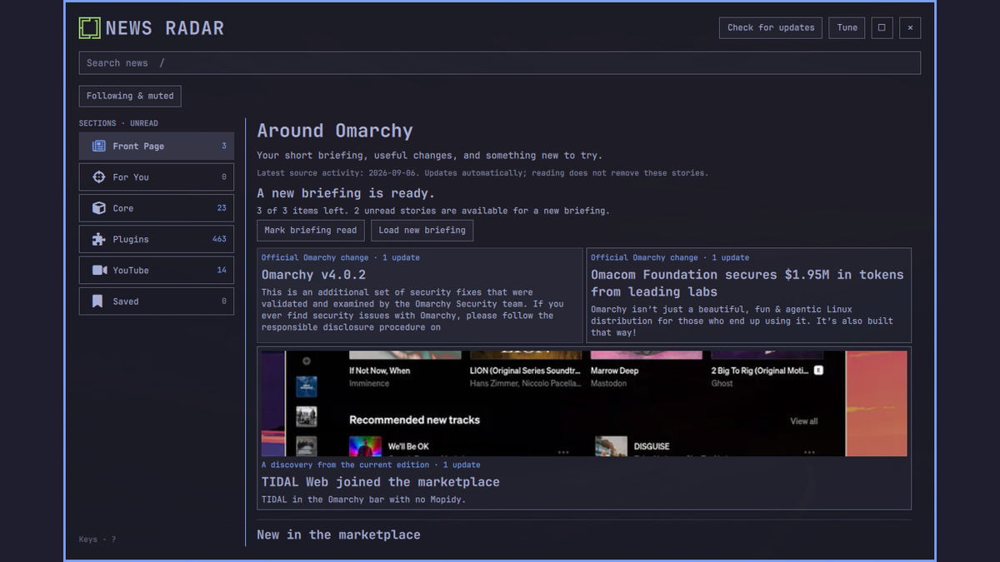

# Omarchy News Radar

> Press one key and catch up with what changed across Omarchy.

Omarchy News Radar is a visual, keyboard-first, source-linked activity reader for Omarchy releases, marketplace changes, and reviewed community work. It is an independent community project with an optional newspaper status widget, a full panel, a deterministic Python collector/publisher, a bounded static JSON/RSS/HTML edition with safe mirrored previews, and a cached local reader that remains useful offline.



## Project status

Version `0.1.5` is the current public release. Its source, live Pages edition, release evidence, exact public-clone Plugin Lab acceptance, and maintainer-controlled [marketplace listing](https://plugins.omarchy.org/plugin.html?id=io.github.mtolhuys.news-radar) are public. Marketplace verification is commit-specific compatibility evidence, not a security audit.

The main plugin declares `panel` and `bar-widget`. Its newspaper is visible by default, shows unread/source status, and is optional: right-click hides it with zero remaining bar geometry, while Tune in the panel restores it. Version 1 still has no daemon, desktop notification, telemetry, account, analytics, AI summary, or plugin-management action.

## What is included

- A standard-library Python collector for published Omarchy releases, bounded marketplace catalog diffs, official anonymous marketplace engagement aggregates, and reviewed repository-owned community records.
- A tracked normalized source snapshot with a rolling 90-day event ledger, bounded 12-item/14-day first marketplace backfill, two-successful-run retirement confirmation, partial-source preservation, deterministic IDs, and restricted curation overlays.
- Atomic publication of validated `events.json`, RSS, escaped static HTML/CSS, bounded archives, build digest metadata, and allowlisted marketplace previews mirrored to same-origin content-addressed raster assets.
- A fixed-origin client helper with cached-first reads, bounded HTTPS, closed redirects, validation before replacement, one-refresh locking, serialized atomic private XDG state, corrupt-state quarantine, saved items, bounded per-story read overrides, and explicit purge.
- A resizable, maximizable theme-native QML window with normal `Alt+Tab`, summon-to-focus activation, contrast-safe primary and secondary text, images, icon metrics, source-derived plugin explanations, human-facing marketplace links, Front Page, automatic installed-plugin relevance, Core, Plugins, and Saved, fixed section identity, per-section filters, finite keyboard/pointer pagination, an always-visible keyboard guide, search, source opening, visible update-check progress and honest publisher/source/cache states, responsive layout, and virtualized story rows.
- An exact opt-in hosted-window identity used by compatible local AltTab and Omadock companions to show Radar's newspaper icon without relabeling unrelated Quickshell windows.
- A bundled Radar application mark, newspaper-prefixed compositor title, and exact manifest `windowIdentity`. Compatible local AltTab and Omadock candidates resolve it to the newspaper; other switchers that ignore the declaration may still choose Quickshell's generic icon.
- A theme-native bar newspaper with unread count and health dot, default-on placement, zero-gap local hiding, due-checked refresh, and panel-based restoration.
- A narrowly scoped shortcut helper that installs `Super+Alt+N` only when the personal configuration and live binding table show that it is free, and explicitly migrates only Radar's exact unmodified 0.1.3-owned block; it never displaces Editor or another action.
- An explicit XDG application-launcher helper that exposes Radar in Omarchy's Apps menu, updates only its receipt-backed desktop entry and icon, and preserves modified or unrelated files.
- Offline unit/integration tests, pinned least-privilege workflows, and disposable Plugin Lab journeys for local-candidate and exact public-clone acceptance.

## Review the local candidate

The four source gates are offline and do not activate desktop integration:

```bash
make test
make validate
make feed-fixture
make site
```

Generated site output is written to ignored `dist/`. Desktop installation, enabling, shortcut changes, Hyprland reloads, rendered interaction, hot updates, and removal belong only in the disposable Omarchy Plugin Lab during development; see [`docs/TESTING.md`](docs/TESTING.md).

### Test the unpublished checkout locally

The safest complete test uses the disposable Omarchy Plugin Lab and does not touch the daily desktop:

```bash
cd ~/Projects/omarchy/plugin-lab
./bin/lab doctor
./bin/lab plugin ~/Projects/plugins/omarchy-news-radar/tests/lab/acceptance.sh
```

The Lab scenario seeds a deterministic guest-only feed, installs the conflict-free `Super+Alt+N` binding, drives the real bar and panel, captures screenshots, proves closed/foreground/obscured activation with QMP pointer and compositor shortcut input, checks zero-gap hide/restore, publisher-stale disclosure, animated update-check progress, and keyboard Load more activation, then removes the owned shortcut and plugin. Keep automated development and acceptance in the disposable VM; the command below is an explicit owner-run opt-in for intentional daily use, not a test route.

### Keep an intentional local installation current

When you deliberately want to run this checkout on your daily desktop, use:

```bash
make local-latest
```

The first run validates, clones, and enables the current committed checkout, installs Radar's managed Apps-menu entry, then collects a real edition from the live allowlisted Omarchy release and marketplace sources. It validates and mirrors eligible marketplace images and atomically imports the edition and image assets into Radar's private cache. Later runs fast-forward the installed clone, safely update the launcher entry, rescan the plugin, and collect a new local edition. The panel labels this mode “Local live edition” while that owner-built edition is newest. **Check for updates** still checks Pages, refuses to downgrade the local edition, and automatically returns to the published stream as soon as it advances.

“Latest” means this repository's current committed `HEAD` plus a collection performed at command time. The command never runs `git pull`, refuses uncommitted source or installed changes, preserves a deliberately disabled modern installation, leaves `Super+Alt+N` untouched, and refuses to repoint an installation from another checkout or public URL. A one-time migration recognizes only the exact unmodified panel-only preview placement, moves that owned entry through Omarchy's supported lifecycle to the default right-side newspaper, and restores the canonical bar/image defaults. Ambiguous or customized placement is refused rather than overwritten. It is intentionally not a background updater.

## Install v0.1.5

Install the tagged public release directly with:

```bash
omarchy plugin add https://github.com/mtolhuys/omarchy-news-radar --enable --yes
~/.config/omarchy/plugins/io.github.mtolhuys.news-radar/bin/news-radar-launcher install
```

The panel is always reachable without changing a shortcut:

```bash
omarchy-shell shell summon io.github.mtolhuys.news-radar
```

The explicit launcher command creates the **Omarchy News Radar** row in the normal Apps menu with the bundled newspaper mark. Omarchy's third-party plugin lifecycle intentionally runs no install hooks, so a public plugin add cannot create that XDG entry implicitly. `status`, `install`, and `remove` are idempotent and refuse symlinked, modified, unowned, or unrelated targets.

### Explicit shortcut setup

Radar uses `Super+Alt+N`; Omarchy's `Super+Shift+N` Editor/Neovim shortcut remains unchanged. First inspect the personal configuration and live binding table without mutation:

```bash
~/.config/omarchy/plugins/io.github.mtolhuys.news-radar/bin/news-radar-shortcut status
```

If `status` reports `classification: free`, install the owned Radar binding:

```bash
~/.config/omarchy/plugins/io.github.mtolhuys.news-radar/bin/news-radar-shortcut install
```

The helper refuses personal, multiple, unknown, symlinked, unowned, or ambiguous configuration. It creates a timestamped backup, writes one clearly marked bind-only Radar block, reloads Hyprland, validates the live action and config errors, and rolls back on failure. There is no unbind, Editor replacement, or force flag.

If an earlier Radar version installed the old close-on-repeat binding, opening 0.1.5 through the newspaper, Apps row, or documented IPC shows **Update shortcut**. That action changes only the exact unmodified Radar-owned block from `toggle` to `summon`; opening the panel itself is read-only. The same explicit migration is available from the command above: `status` reports `owned-legacy`, then `install` performs the backed-up migration. Edited or personal blocks remain refused.

To choose another free chord, skip the helper and add your own reviewed line to `~/.config/hypr/bindings.lua`, for example:

```lua
o.bind("SUPER + SHIFT + R", "Omarchy News Radar", "omarchy-shell shell summon io.github.mtolhuys.news-radar")
```

## Panel controls

- `1`–`5`: Front Page, For You, Core, Plugins, Saved.
- `Tab` / `Shift+Tab`: cycle forward or backward through sections.
- `j` / `k` or arrow keys: move the selected story. Crossing the viewport bottom smoothly anchors the newly selected row at the top, then normal row-by-row movement continues without bottom overlap. Down from the final loaded story focuses **Load more**, labels the Enter action, and Enter loads the next page.
- `Home` / `End`: first or last story.
- `u`: mark the selected story read or unread locally.
- `/`: focus local search; `Escape` returns to panel navigation.
- `o` or `Enter`: open the selected validated HTTPS source.
- `s`: save or unsave the selected story locally.
- `r`: **Check for updates** once against the published static edition, with an animated progress indicator while cached content stays readable; the result reports adopted new stories, no newer edition, publisher lag, invalid data, or offline cache preservation.
- `Escape` or `q`: close the panel.
- `Tune`: enable or disable the top-bar newspaper and story images.
- `⚙ Settings`: inspect the section's fixed sources, then locally refine time, significance, unread/image state, and story types. Names, icons, order, background, and source scope remain canonical.
- `Mark all as read`: atomically mark every unread story matching the current section's Settings, including unloaded pages. Temporary search does not change this scope.
- `Load more`: reveal the next twelve matching stories from the already validated bounded edition by pointer or keyboard.

Every row explicitly says `● UNREAD` or `✓ READ`. Deliberate pointer selection, `j`/`k`, `Home`/`End`, and source activation mark only that story read; hover, opening the panel, refreshing, and closing do not mark the rest of the edition. The only batch transition is the explicit **Mark all as read** section action. The section rail and top-bar newspaper use the same durable local unread predicate, and **Mark read / Mark unread** in the inspector mirrors the `u` key.

The window uses the normal desktop window model: drag the masthead to move it, resize from an edge, use Maximize/Restore, and switch to or from it with `Alt+Tab`. Radar intentionally omits its unreliable minimize control.

Marketplace views, hearts, command copies, repository stars, and GitHub release-asset download counts appear as compact colored icons with accessible labels and an observation time. Raw metric endpoint links stay in feed provenance but are intentionally absent from the reader; plugin stories instead link to their human-facing `plugins.omarchy.org` detail page. Marketplace aggregates are anonymous interactions—not installs, downloads, unique people, rankings, votes, or security signals—and metrics never influence Front Page ordering.

Exact enabled plugin IDs are used only for local `For You` matching. They are never sent to the feed host. The nonfunctional manual interests control and its hidden state were removed in `0.1.1`.

Reviewed community links are an optional edition input, not a dedicated reader section. If the project later accepts a source record under `content/community/`, the validated story may appear in Front Page or For You; an empty input never creates an empty navigation destination.

## Newspaper controls

- Left click: summon News Radar; an obscured or foreground instance is raised and focused rather than closed.
- Middle click: check the published edition once.
- Right click: hide the newspaper immediately; its bar slot collapses to zero.
- Restore: press `Super+Alt+N` (or use shell IPC), choose Tune, then set “Top-bar newspaper” to On.

The visible widget records network-check time separately from edition age. It checks at most once every 15 minutes after success, retries after five minutes when a check fails, and watches the private feed cache so the unread badge changes as soon as a valid edition is adopted—even while the panel is closed. Hiding the newspaper stops network checks. Radar deliberately uses this passive badge rather than desktop pop-up notifications.

## Local data and removal

Radar uses:

```text
${XDG_CACHE_HOME:-$HOME/.cache}/omarchy-news-radar/feed.json
${XDG_CACHE_HOME:-$HOME/.cache}/omarchy-news-radar/update-check.json
${XDG_CACHE_HOME:-$HOME/.cache}/omarchy-news-radar/assets/images/
${XDG_CACHE_HOME:-$HOME/.cache}/omarchy-news-radar/local-edition.json
${XDG_STATE_HOME:-$HOME/.local/state}/omarchy-news-radar/state.json
${XDG_STATE_HOME:-$HOME/.local/state}/omarchy-news-radar/launcher.json
```

Normal disablement and removal preserve the cache, per-story reading state, and saved items. Remove in this order while the helper still exists:

```bash
~/.config/omarchy/plugins/io.github.mtolhuys.news-radar/bin/news-radar-shortcut remove
~/.config/omarchy/plugins/io.github.mtolhuys.news-radar/bin/news-radar-launcher remove
omarchy plugin remove io.github.mtolhuys.news-radar --yes
```

Removing the exact owned binding releases `Super+Alt+N`; Editor was never changed. Removing the receipt-backed launcher deletes only Radar's unmodified desktop entry and icon. If you also want to delete Radar-owned cache, state, diagnostics, and quarantined state, run the explicit purge before removing the plugin:

```bash
~/.config/omarchy/plugins/io.github.mtolhuys.news-radar/bin/news-radar-client purge
```

If the plugin is removed before its shortcut, the marked block is a harmless unresolved shell IPC action; remove only the block between the `OMARCHY NEWS RADAR MANAGED SHORTCUT` markers or reinstall the same plugin checkout and run `remove`.

## Collection and publication

Production collection is explicit and networked; ordinary tests never run it:

```bash
python3 -m radar collect --bootstrap-marketplace  # first successful baseline only
python3 -m radar collect                          # later editions
```

The first successful marketplace run publishes at most twelve genuinely recent listings from the previous fourteen days, then records the complete baseline. It never treats the historical catalog as new. A failed adapter retains its prior normalized state and cannot manufacture additions, releases, or mass retirements.

The Pages workflow requests best-effort runs at minutes 8, 23, 38, and 53 and also supports manual dispatch. Off-peak quarter-hour opportunities reduce the impact of a delayed or dropped GitHub invocation; GitHub does not guarantee scheduled delivery. The workflow keeps repository permissions read-only, never cancels an in-progress publication, and uploads the updated `state/source-snapshot.json` as a run artifact. The owner must periodically review, validate, and commit that artifact so multi-run retirement confirmation and baseline advancement remain explicit.

Feed `checkedAt` values describe individual source attempts, `generatedAt` describes completed collection, and `publishedAt` describes the static artifact build. GitHub Pages/CDN propagation may take up to ten minutes after deployment; the client additionally reports when its validated local copy was cached. Radar labels the publisher stale only after `publishedAt` is more than 90 minutes old, so an old successful source check can never masquerade as current publication. Operational recovery and exact release steps are in [`docs/RELEASE.md`](docs/RELEASE.md).

## Documentation

Start with [`AGENTS.md`](AGENTS.md). The binding product, architecture, data, source, security, testing, implementation, decision, and release contracts live under [`docs/`](docs/). [`docs/RESEARCH.md`](docs/RESEARCH.md) records the dated Omarchy, shortcut, marketplace, and Plugin Lab audits.

## Independence

Omarchy News Radar is not an official Omarchy project and does not imply endorsement, marketplace verification as a security audit, or guaranteed compatibility. Every story links its original source so readers can verify the underlying claim.
